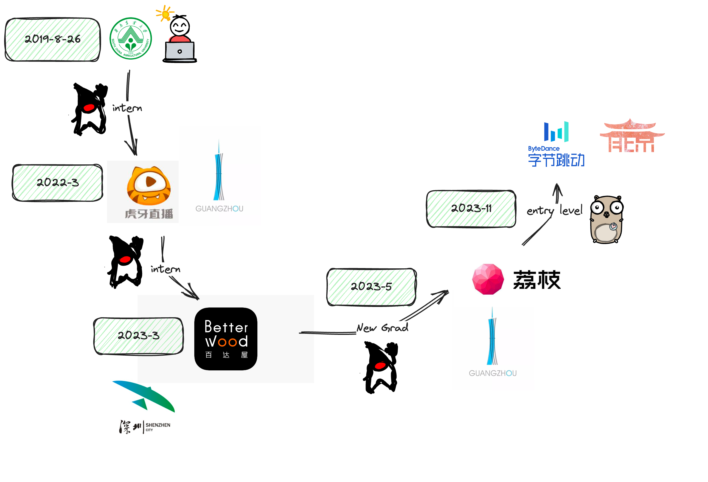

# Java开发工程师

> Java是入门较为简单的一门编程语言

## Java基础（✨✨✨✨✨）

<mark style="background-color:orange;">可以参考本项目附录中的《onJava8》一书。</mark>

1. 认识并能使用常见的JDK封装的数据结构。e.g. List Set Map 接口下的各个数据结构。
2. 关键字的使用、含义。 e.g. synchronize [volatile ](https://www.baeldung.com/java-volatile)final static 。
3. 并发编程相关的工具类。 e.g. Object的wait、notify方法 ；ReentrantLock [CountDownLatch ](https://leetcode.cn/problems/print-foobar-alternately/solutions/)[Semaphore ](https://leetcode.cn/problems/print-foobar-alternately/solutions/)[CyclicBarrier ](https://leetcode.cn/problems/print-foobar-alternately/solutions/)
4. 常见设计模式：单例（懒/饿汉、Double check、内部类）、策略、工厂。

以下了解即可（如果能掌握更好）

Java内存模型、JVM。


可参考《深入理解JVM》

如果你想了解更多，可以参考B站[UP主](https://space.bilibili.com/31359187/)搬运翻译的视频。


反射及其衍生的相关内容。如AOP、代理模式。

## 数据库

截止编写该文档之前，互联网公司的主流选择仍是MySQL（且默认都是Innodb引擎）。你可以参阅以下资料进行学习。（🤯代表阅读难度——此处的阅读难度都是相较之下而言）

* 《高性能MySQL》🤯🤯🤯（可在本项目的附录文件中获取英文版本）
* 《MySQL技术内幕++InnoDB存储引擎》🤯🤯🤯
* [小林coding](https://xiaolincoding.com/mysql/)  🤯

作为一个应届校招生，在参阅上述资料中的一个或多个内容后你应该至少掌握：

1. MySQL支持的关键字和简单的SQL的编写。
2. 支撑存储的数据结构。为什么要选取该结构？
3. ACID分别是什么？在MySQL中是如何去保证的？
4. Innodb中是如何实现四个隔离级别的？
5. 索引的作用、原理。（面试中可能会给出SQL和对应的表结构考察对这方面的掌握程度）

如果能掌握以下知识会更好：

* Explain关键字的使用——强烈建议参阅《高性能MySQL》中的Using EXPLAIN一章。
* SQL调优——通过项目或实习积攒经验。
* 啃下两本书或其中一本。

## 其他中间件

### Redis

作为互联网广泛使用的缓存中间件，你可以参阅以下资料进行学习：

* 《Redis 深度历险：核心原理与应用实践》🤯
* [小林coding](https://xiaolincoding.com/redis/)

作为应届校招生，你应该至少掌握：

* 五大数据结构的使用及其原理
* 持久化机制（面试常考）
* 缓存击穿、穿透、雪崩（面试常考）
* Cache Asside Pattern的原理。

如果能掌握下列内容会更好：

* Redis Cluster相关（基本都是靠背，除非在实习中能接触到）
* 利用Redis实现分布式锁


思考Redis和MySQL之间的联系。构建一个项目时一定需要引入Redis吗？带来的收益和坏处？


### 消息队列

根据个人情况选取一个学习了解。没有时间可以考虑跳过。

#### Rabbit MQ

#### Rocket MQ

#### Kafaka

### 微服务相关组件

#### Nacos

## 开发框架

### Spring相关的IOC框架。

必须会使用！！！

不建议过于深入研究框架源码(源码对于初学者来说有一定的阅读难度，而且收益不高。）


根据面向对象的思想思考为什么需要有IOC容器？


### Mybatis & Mybatis-plus

受制于国内互联网生态的限制，Mybatis这种半自动化框架便于直观的编写和修改SQL。

必须会使用！！！

个人项目若不涉及复杂的多表查询可以考虑使用 **Spring-Data-JPA**

